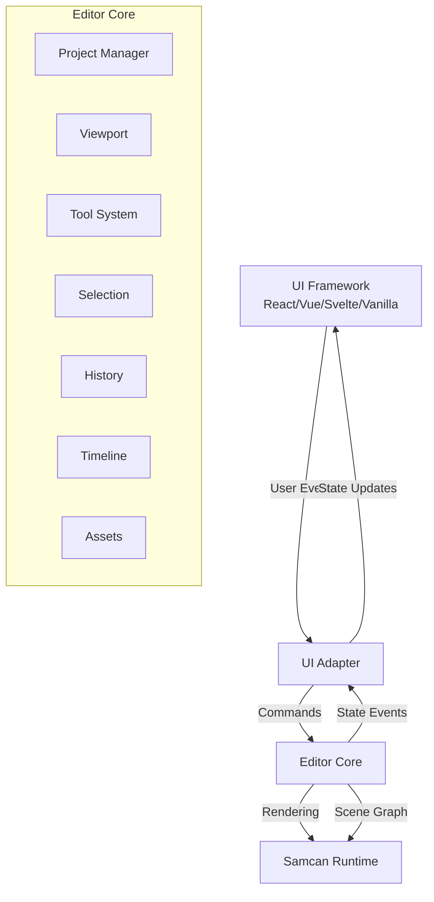

# Design Document

## Overview

The samcan Editor is architected as a framework-agnostic core with optional UI adapters. The core provides all business logic, state management, and command execution in pure TypeScript, while UI adapters translate framework-specific events and state updates. This design enables integration with React, Vue, Svelte, vanilla TypeScript, or any other UI framework.

The editor consumes the samcan runtime for rendering and animation playback, extending it with authoring capabilities like selection, manipulation tools, timeline editing, and project serialization.

## Architecture

### High-Level Structure

```
editor/
├── core/                    # Framework-agnostic editor core
│   ├── editorcore.ts       # Main editor instance
│   ├── project/            # Project and document management
│   ├── viewport/           # Canvas viewport and coordinate systems
│   ├── tools/              # Tool system and built-in tools
│   ├── selection/          # Selection management
│   ├── history/            # Undo/redo command history
│   ├── timeline/           # Timeline and keyframe management
│   ├── assets/             # Asset management
│   ├── clipboard/          # Copy/paste operations
│   ├── grid/               # Grid and snapping
│   ├── shortcuts/          # Keyboard shortcut registry
│   ├── plugins/            # Plugin system
│   └── events/             # Event system
├── adapters/               # Framework-specific adapters
│   ├── react/             # React adapter (example)
│   ├── vue/               # Vue adapter (example)
│   └── vanilla/           # Vanilla TS adapter (example)
└── index.ts               # Public API exports
```


### Core Principles

1. **Framework Independence**: The editor core has zero dependencies on UI frameworks. All state changes are communicated through events.

2. **Command Pattern**: All user actions are encapsulated as commands, enabling undo/redo and macro recording.

3. **Event-Driven**: The core emits events for all state changes. UI adapters subscribe to these events to update their framework's state.

4. **Immutable Public APIs**: Public getters return readonly data to prevent external mutation of internal state.

5. **Runtime Integration**: The editor uses the samcan runtime for rendering and animation, extending it with authoring features.

### Architecture Diagram



## Components and Interfaces

### 1. EditorCore

The main editor instance that coordinates all subsystems.


**Interface:**
```typescript
interface EditorCore {
    // Subsystems
    readonly project: ProjectManager
    readonly viewport: Viewport
    readonly tools: ToolManager
    readonly selection: SelectionManager
    readonly history: HistoryManager
    readonly timeline: TimelineManager
    readonly assets: AssetManager
    readonly clipboard: ClipboardManager
    readonly grid: GridManager
    readonly shortcuts: ShortcutRegistry
    readonly plugins: PluginManager
    
    // Event system
    on(event: EditorEvent, handler: EventHandler): void
    off(event: EditorEvent, handler: EventHandler): void
    emit(event: EditorEvent, data: unknown): void
    
    // Lifecycle
    initialize(config: EditorConfig): void
    destroy(): void
    
    // Rendering
    render(): void
    requestRender(): void
}
```

**Responsibilities:**
- Initialize and coordinate all subsystems
- Provide unified event system
- Manage render loop integration with runtime
- Expose public API for UI adapters

### 2. ProjectManager

Manages project lifecycle, serialization, and metadata.

**Interface:**
```typescript
interface ProjectManager {
    readonly current: Project | null
    readonly isModified: boolean
    
    createNew(settings: ProjectSettings): Project
    load(data: string | object): Project
    save(): ProjectData
    export(options: ExportOptions): RuntimeData
    
    setModified(modified: boolean): void
}

interface Project {
    readonly id: string
    readonly name: string
    readonly settings: ProjectSettings
    readonly artboards: readonly Artboard[]
    readonly activeArtboard: Artboard | null
    
    addArtboard(artboard: Artboard): void
    removeArtboard(id: string): void
    setActiveArtboard(id: string): void
}
```


**Responsibilities:**
- Create, load, and save projects
- Manage project metadata and settings
- Serialize/deserialize project data
- Export to runtime format
- Track modification state

**Key Design Decisions:**
- Projects contain multiple artboards (scenes)
- Each artboard has independent timeline and scene graph
- Export can target individual artboards or entire project
- Validation occurs during load and export

### 3. Viewport

Manages canvas viewport state and coordinate transformations.

**Interface:**
```typescript
interface Viewport {
    readonly zoom: number
    readonly pan: Vector2
    readonly bounds: Rectangle
    
    setZoom(zoom: number): void
    setPan(pan: Vector2): void
    zoomToFit(bounds: Rectangle): void
    zoomToSelection(): void
    
    // Coordinate conversion
    screenToWorld(point: Vector2): Vector2
    worldToScreen(point: Vector2): Vector2
    screenToWorldDelta(delta: Vector2): Vector2
    worldToScreenDelta(delta: Vector2): Vector2
}
```

**Responsibilities:**
- Maintain zoom level (10% to 6400%)
- Maintain pan offset
- Convert between screen and world coordinates
- Provide viewport bounds for culling
- Apply viewport transform to renderer

**Key Design Decisions:**
- Zoom is centered on cursor position
- Pan uses screen-space deltas
- Coordinate conversion accounts for zoom and pan
- Viewport state is independent of renderer


### 4. ToolManager and Tool System

Manages active tool and routes input events.

**Interface:**
```typescript
interface ToolManager {
    readonly activeTool: Tool | null
    readonly tools: ReadonlyMap<string, Tool>
    
    registerTool(id: string, tool: Tool): void
    unregisterTool(id: string): void
    setActiveTool(id: string): void
}

interface Tool {
    readonly id: string
    readonly name: string
    readonly cursor: string
    
    // Lifecycle
    onActivate(context: ToolContext): void
    onDeactivate(context: ToolContext): void
    
    // Input events
    onPointerDown(event: PointerEvent, context: ToolContext): void
    onPointerMove(event: PointerEvent, context: ToolContext): void
    onPointerUp(event: PointerEvent, context: ToolContext): void
    onKeyDown(event: KeyboardEvent, context: ToolContext): void
    onKeyUp(event: KeyboardEvent, context: ToolContext): void
    
    // Rendering
    onRender(context: ToolContext): void
}

interface ToolContext {
    readonly editor: EditorCore
    readonly viewport: Viewport
    readonly selection: SelectionManager
    readonly history: HistoryManager
    readonly renderer: Renderer
}
```

**Built-in Tools:**

1. **SelectionTool**: Click to select, drag to marquee select, handles to transform
2. **DirectSelectionTool**: Select and edit individual path points
3. **PenTool**: Create and edit bezier paths
4. **RectangleTool**: Draw rectangles
5. **EllipseTool**: Draw ellipses
6. **TextTool**: Create and edit text

**Responsibilities:**
- Register and manage tool instances
- Activate/deactivate tools
- Route input events to active tool
- Provide tool context with editor state
- Render tool overlays (handles, guides, etc.)


**Key Design Decisions:**
- Tools are stateful objects that persist across activations
- Only one tool is active at a time
- Tools receive context object with editor state
- Tools can render overlays on top of scene
- Tools create commands for undoable operations

### 5. SelectionManager

Manages the set of selected scene nodes.

**Interface:**
```typescript
interface SelectionManager {
    readonly selected: readonly SceneNode[]
    readonly count: number
    readonly isEmpty: boolean
    
    select(nodes: SceneNode | SceneNode[]): void
    deselect(nodes: SceneNode | SceneNode[]): void
    clear(): void
    toggle(node: SceneNode): void
    
    contains(node: SceneNode): boolean
    getBounds(): Rectangle | null
    getCommonProperties(): PropertyMap
}
```

**Responsibilities:**
- Maintain set of selected nodes
- Support single and multi-selection
- Emit selection changed events
- Calculate selection bounds
- Extract common properties for batch editing

**Key Design Decisions:**
- Selection is order-preserving (for tab navigation)
- Deleted nodes are automatically removed from selection
- Selection bounds are in world space
- Common properties return intersection of selected node properties


### 6. HistoryManager

Implements undo/redo using the command pattern.

**Interface:**
```typescript
interface HistoryManager {
    readonly canUndo: boolean
    readonly canRedo: boolean
    readonly undoStack: readonly Command[]
    readonly redoStack: readonly Command[]
    
    execute(command: Command): void
    undo(): void
    redo(): void
    clear(): void
    
    beginBatch(name: string): void
    endBatch(): void
}

interface Command {
    readonly name: string
    execute(): void
    undo(): void
    redo(): void
}
```

**Responsibilities:**
- Execute commands and add to history
- Undo/redo operations
- Maintain history stacks (limit: 100 commands)
- Support command batching for multi-step operations
- Emit history changed events

**Key Design Decisions:**
- Commands are responsible for their own undo logic
- Batched commands are treated as single history entry
- History limit prevents memory issues
- Redo stack is cleared when new command is executed

### 7. TimelineManager

Manages animation timeline state and keyframes.

**Interface:**
```typescript
interface TimelineManager {
    readonly currentTime: number
    readonly duration: number
    readonly isPlaying: boolean
    readonly playbackSpeed: number
    
    setCurrentTime(time: number): void
    setDuration(duration: number): void
    play(): void
    pause(): void
    stop(): void
    setPlaybackSpeed(speed: number): void
    
    // Keyframes
    createKeyframe(node: SceneNode, property: string, time: number): Keyframe
    moveKeyframe(keyframe: Keyframe, time: number): void
    deleteKeyframe(keyframe: Keyframe): void
    getKeyframes(node: SceneNode, property?: string): readonly Keyframe[]
}
```


**Responsibilities:**
- Maintain timeline state (current time, duration, playback)
- Integrate with runtime clock for playback
- Create, move, and delete keyframes
- Query keyframes for nodes and properties
- Emit timeline events (time changed, playback state changed)

**Key Design Decisions:**
- Timeline state is per-artboard
- Playback uses runtime clock for consistency
- Keyframes store property values at specific times
- Scrubbing updates current time without playback
- Playback speed affects clock rate (10% to 400%)

### 8. AssetManager

Manages imported assets (images, fonts, etc.).

**Interface:**
```typescript
interface AssetManager {
    readonly assets: ReadonlyMap<string, Asset>
    
    import(file: File | Blob, type: AssetType): Promise<Asset>
    get(id: string): Asset | undefined
    delete(id: string): void
    list(type?: AssetType): readonly Asset[]
}

interface Asset {
    readonly id: string
    readonly name: string
    readonly type: AssetType
    readonly data: ArrayBuffer | string
    readonly metadata: AssetMetadata
}

type AssetType = 'image' | 'font' | 'audio'
```

**Responsibilities:**
- Import and store assets
- Generate unique asset IDs
- Provide asset lookup and listing
- Delete assets and update references
- Validate asset formats

**Key Design Decisions:**
- Assets are stored in project data
- Supported image formats: PNG, JPEG, SVG, WebP
- Asset IDs are UUIDs
- Deleting asset removes scene references
- Assets can be embedded or referenced in export


### 9. ClipboardManager

Handles copy, cut, and paste operations.

**Interface:**
```typescript
interface ClipboardManager {
    copy(nodes: readonly SceneNode[]): void
    cut(nodes: readonly SceneNode[]): void
    paste(): readonly SceneNode[]
    canPaste(): boolean
}
```

**Responsibilities:**
- Serialize selected nodes to clipboard
- Deserialize clipboard data to nodes
- Offset pasted nodes to avoid overlap
- Create commands for cut/paste operations

**Key Design Decisions:**
- Clipboard data is JSON serialization of nodes
- Pasted nodes are offset by 10 pixels
- Cut operation copies then deletes
- Paste creates new node instances (deep copy)

### 10. GridManager

Manages grid display and snapping behavior.

**Interface:**
```typescript
interface GridManager {
    readonly enabled: boolean
    readonly visible: boolean
    readonly size: number
    readonly snapEnabled: boolean
    readonly snapThreshold: number
    
    setEnabled(enabled: boolean): void
    setVisible(visible: boolean): void
    setSize(size: number): void
    setSnapEnabled(enabled: boolean): void
    
    snapPoint(point: Vector2): Vector2
    snapToObjects(point: Vector2, exclude: SceneNode[]): SnapResult | null
}

interface SnapResult {
    readonly point: Vector2
    readonly guides: SnapGuide[]
}
```

**Responsibilities:**
- Maintain grid settings
- Snap points to grid intersections
- Snap to object edges and centers
- Provide snap guides for rendering
- Emit settings changed events


**Key Design Decisions:**
- Grid snapping uses world coordinates
- Object snapping uses screen-space threshold (5px)
- Snap guides are visual feedback for alignment
- Snapping can be temporarily disabled with modifier key

### 11. ShortcutRegistry

Maps keyboard shortcuts to commands.

**Interface:**
```typescript
interface ShortcutRegistry {
    readonly shortcuts: ReadonlyMap<string, ShortcutBinding>
    
    register(shortcut: string, command: string, handler: () => void): void
    unregister(shortcut: string): void
    handle(event: KeyboardEvent): boolean
    
    getDefaults(): ShortcutBinding[]
    reset(): void
}

interface ShortcutBinding {
    readonly shortcut: string
    readonly command: string
    readonly handler: () => void
}
```

**Default Shortcuts:**
- `Cmd/Ctrl+Z`: Undo
- `Cmd/Ctrl+Shift+Z`: Redo
- `Cmd/Ctrl+C`: Copy
- `Cmd/Ctrl+X`: Cut
- `Cmd/Ctrl+V`: Paste
- `Delete/Backspace`: Delete selection
- `Cmd/Ctrl+A`: Select all
- `Cmd/Ctrl+D`: Deselect all
- `V`: Selection tool
- `A`: Direct selection tool
- `P`: Pen tool
- `R`: Rectangle tool
- `O`: Ellipse tool
- `T`: Text tool
- `Space`: Pan (hold)
- `Cmd/Ctrl+0`: Zoom to fit
- `Cmd/Ctrl++`: Zoom in
- `Cmd/Ctrl+-`: Zoom out

**Responsibilities:**
- Register and manage shortcuts
- Handle keyboard events
- Validate shortcut conflicts
- Provide default shortcuts
- Support customization


**Key Design Decisions:**
- Shortcuts use platform-agnostic format (Cmd/Ctrl)
- Conflicts are detected during registration
- Shortcuts can be disabled/overridden by tools
- Space bar for pan requires hold detection

### 12. PluginManager

Enables extensibility through plugins.

**Interface:**
```typescript
interface PluginManager {
    readonly plugins: ReadonlyMap<string, Plugin>
    
    register(plugin: Plugin): void
    unregister(id: string): void
    get(id: string): Plugin | undefined
}

interface Plugin {
    readonly id: string
    readonly name: string
    readonly version: string
    
    initialize(context: PluginContext): void
    destroy(): void
}

interface PluginContext {
    readonly editor: EditorCore
    registerTool(tool: Tool): void
    registerCommand(command: Command): void
    registerPropertyEditor(type: string, editor: PropertyEditor): void
}
```

**Responsibilities:**
- Register and manage plugins
- Provide plugin context with editor access
- Validate plugin interfaces
- Initialize/destroy plugins
- Enable plugin-contributed tools and commands

**Key Design Decisions:**
- Plugins receive full editor context
- Plugins can extend tools, commands, and property editors
- Plugin lifecycle is managed by editor
- Plugins are validated on registration


### 13. Event System

Framework-agnostic event system for state changes.

**Interface:**
```typescript
type EditorEvent = 
    | 'project:created'
    | 'project:loaded'
    | 'project:modified'
    | 'selection:changed'
    | 'viewport:changed'
    | 'tool:changed'
    | 'history:changed'
    | 'timeline:changed'
    | 'timeline:timeChanged'
    | 'artboard:changed'
    | 'node:added'
    | 'node:removed'
    | 'node:modified'
    | 'property:changed'
    | 'asset:added'
    | 'asset:removed'
    | 'settings:changed'

interface EventEmitter {
    on(event: EditorEvent, handler: EventHandler): void
    off(event: EditorEvent, handler: EventHandler): void
    emit(event: EditorEvent, data: unknown): void
}

type EventHandler = (data: unknown) => void
```

**Responsibilities:**
- Provide type-safe event system
- Support subscription and unsubscription
- Emit events for all state changes
- Enable reactive UI updates

**Key Design Decisions:**
- Events are strongly typed
- Event data is type-specific per event
- Handlers are called synchronously
- No event bubbling or capturing

## Data Models

### Project Data Structure

```typescript
interface ProjectData {
    version: string
    id: string
    name: string
    settings: ProjectSettings
    artboards: ArtboardData[]
    assets: AssetData[]
}

interface ProjectSettings {
    width: number
    height: number
    frameRate: number
    backgroundColor: Color
}
```


### Artboard Data Structure

```typescript
interface ArtboardData {
    id: string
    name: string
    width: number
    height: number
    backgroundColor: Color
    sceneGraph: SceneNodeData
    timeline: TimelineData
}

interface TimelineData {
    duration: number
    tracks: TrackData[]
}

interface TrackData {
    nodeId: string
    property: string
    keyframes: KeyframeData[]
}

interface KeyframeData {
    time: number
    value: unknown
    easing: EasingFunction
}
```

### Asset Data Structure

```typescript
interface AssetData {
    id: string
    name: string
    type: AssetType
    data: string // Base64 encoded
    metadata: {
        width?: number
        height?: number
        format?: string
        size: number
    }
}
```

### Export Format

The editor exports to the runtime JSON format:

```typescript
interface RuntimeData {
    version: string
    artboards: RuntimeArtboard[]
    assets: RuntimeAsset[]
}

interface RuntimeArtboard {
    id: string
    width: number
    height: number
    nodes: RuntimeNode[]
    animations: RuntimeAnimation[]
}
```

## UI Adapter Pattern

UI adapters bridge the framework-agnostic core with specific UI frameworks.


### React Adapter Example

```typescript
// React hook for editor integration
function useEditor(config: EditorConfig) {
    const [editor] = useState(() => new EditorCore(config))
    const [state, setState] = useState(() => getEditorState(editor))
    
    useEffect(() => {
        const handlers = {
            'selection:changed': () => setState(getEditorState(editor)),
            'viewport:changed': () => setState(getEditorState(editor)),
            'project:modified': () => setState(getEditorState(editor)),
            // ... other events
        }
        
        Object.entries(handlers).forEach(([event, handler]) => {
            editor.on(event as EditorEvent, handler)
        })
        
        return () => {
            Object.entries(handlers).forEach(([event, handler]) => {
                editor.off(event as EditorEvent, handler)
            })
            editor.destroy()
        }
    }, [editor])
    
    return { editor, state }
}

// React component
function EditorCanvas({ editor }: { editor: EditorCore }) {
    const canvasRef = useRef<HTMLCanvasElement>(null)
    
    useEffect(() => {
        if (!canvasRef.current) return
        
        const handlePointerDown = (e: PointerEvent) => {
            editor.tools.activeTool?.onPointerDown(e, getToolContext(editor))
        }
        
        canvasRef.current.addEventListener('pointerdown', handlePointerDown)
        return () => {
            canvasRef.current?.removeEventListener('pointerdown', handlePointerDown)
        }
    }, [editor])
    
    return <canvas ref={canvasRef} />
}
```

### Vue Adapter Example

```typescript
// Vue composable
function useEditor(config: EditorConfig) {
    const editor = new EditorCore(config)
    const state = reactive(getEditorState(editor))
    
    const updateState = () => {
        Object.assign(state, getEditorState(editor))
    }
    
    onMounted(() => {
        editor.on('selection:changed', updateState)
        editor.on('viewport:changed', updateState)
        // ... other events
    })
    
    onUnmounted(() => {
        editor.destroy()
    })
    
    return { editor, state }
}
```


### Vanilla TypeScript Adapter Example

```typescript
class VanillaEditorAdapter {
    private editor: EditorCore
    private listeners: Map<EditorEvent, Set<EventHandler>>
    
    constructor(config: EditorConfig) {
        this.editor = new EditorCore(config)
        this.listeners = new Map()
        this.setupEventForwarding()
    }
    
    private setupEventForwarding() {
        const events: EditorEvent[] = [
            'selection:changed',
            'viewport:changed',
            'project:modified',
            // ... other events
        ]
        
        events.forEach(event => {
            this.editor.on(event, (data) => {
                this.listeners.get(event)?.forEach(handler => handler(data))
            })
        })
    }
    
    on(event: EditorEvent, handler: EventHandler) {
        if (!this.listeners.has(event)) {
            this.listeners.set(event, new Set())
        }
        this.listeners.get(event)!.add(handler)
    }
    
    getEditor(): EditorCore {
        return this.editor
    }
}
```

## Error Handling

### Validation Errors

```typescript
class ValidationError extends Error {
    constructor(
        message: string,
        public readonly field: string,
        public readonly value: unknown
    ) {
        super(message)
        this.name = 'ValidationError'
    }
}
```

**Validation occurs at:**
- Project load (schema validation)
- Property updates (type and range validation)
- Asset import (format validation)
- Export (completeness validation)
- Plugin registration (interface validation)

### Error Recovery

- **Invalid project data**: Report specific errors, allow partial load
- **Asset load failure**: Show placeholder, allow retry
- **Command execution failure**: Rollback, show error, maintain history integrity
- **Plugin errors**: Isolate plugin, disable if critical, continue editor operation


## Testing Strategy

### Unit Tests

**Core Modules:**
- ProjectManager: serialization, validation, modification tracking
- Viewport: coordinate conversion, zoom/pan bounds
- SelectionManager: selection operations, bounds calculation
- HistoryManager: undo/redo, command batching
- TimelineManager: keyframe operations, playback
- AssetManager: import, storage, deletion
- ClipboardManager: copy/paste, serialization
- GridManager: snapping algorithms
- ShortcutRegistry: shortcut matching, conflict detection
- PluginManager: registration, validation

**Tools:**
- SelectionTool: hit testing, marquee selection, transform handles
- PenTool: path creation, point editing
- Shape tools: creation, constraint handling

**Test Approach:**
- Pure unit tests for business logic
- Mock dependencies (renderer, runtime)
- Test event emission
- Test command creation

### Integration Tests

**Editor Core:**
- Initialize with config
- Coordinate subsystems
- Event propagation
- Render loop integration

**Tool Integration:**
- Tool activation/deactivation
- Input event routing
- Command creation and history
- Selection interaction

**Project Workflow:**
- Create → Edit → Save → Load cycle
- Export to runtime format
- Asset management workflow

### Adapter Tests

**Framework Adapters:**
- Event subscription/unsubscription
- State synchronization
- Command execution
- Lifecycle management

**Test Approach:**
- Test adapter logic, not framework
- Mock editor core
- Verify event handling
- Verify state updates


### End-to-End Tests

**User Workflows:**
- Create project → Add shapes → Animate → Export
- Import assets → Use in scene → Export
- Multi-artboard project creation
- Undo/redo complex operations
- Copy/paste between artboards

**Test Approach:**
- Use vanilla adapter for E2E
- Test complete workflows
- Verify exported data
- Test error scenarios

## Performance Considerations

### Rendering Optimization

- **Dirty Flags**: Only re-render when state changes
- **Viewport Culling**: Skip rendering objects outside viewport
- **Render Batching**: Batch multiple state changes into single render
- **Tool Overlays**: Render on separate layer to avoid full scene re-render

### Memory Management

- **History Limit**: Cap at 100 commands to prevent unbounded growth
- **Asset Caching**: Cache decoded images, clear unused
- **Event Cleanup**: Ensure listeners are removed on destroy
- **Node Pooling**: Reuse node instances where possible

### Event Throttling

- **Viewport Events**: Throttle pan/zoom events during drag
- **Timeline Scrub**: Throttle time updates during scrub
- **Property Updates**: Debounce rapid property changes

### Large Project Handling

- **Lazy Loading**: Load artboards on demand
- **Pagination**: Paginate asset lists
- **Virtual Scrolling**: Use for large layer lists
- **Progressive Rendering**: Render visible layers first

## Security Considerations

### Input Validation

- Validate all user input (property values, file uploads)
- Sanitize text input to prevent XSS
- Validate project JSON schema
- Check file types and sizes on import

### Asset Handling

- Validate image formats before decode
- Limit asset file sizes (e.g., 10MB per asset)
- Scan for malicious content in SVG
- Sanitize asset metadata


### Plugin Security

- Validate plugin interfaces
- Isolate plugin errors
- Limit plugin API access
- Review plugin permissions

## Extensibility Points

### Custom Tools

Developers can create custom tools by implementing the `Tool` interfa
ce:

```typescript
class CustomTool implements Tool {
    readonly id = 'custom-tool'
    readonly name = 'Custom Tool'
    readonly cursor = 'crosshair'
    
    onActivate(context: ToolContext) {
        // Setup tool state
    }
    
    onPointerDown(event: PointerEvent, context: ToolContext) {
        // Handle mouse down
        const worldPos = context.viewport.screenToWorld(
            new Vector2(event.clientX, event.clientY)
        )
        
        // Create command for undo/redo
        const command = new CustomCommand(worldPos)
        context.history.execute(command)
    }
    
    // ... other methods
}

// Register tool
editor.tools.registerTool('custom-tool', new CustomTool())
```

### Custom Commands

```typescript
class CustomCommand implements Command {
    readonly name = 'Custom Action'
    private previousState: unknown
    
    constructor(private data: unknown) {}
    
    execute() {
        this.previousState = getCurrentState()
        applyChange(this.data)
    }
    
    undo() {
        restoreState(this.previousState)
    }
    
    redo() {
        this.execute()
    }
}
```

### Custom Property Editors

```typescript
interface PropertyEditor {
    readonly type: string
    render(value: unknown, onChange: (value: unknown) => void): void
    validate(value: unknown): boolean
}

class ColorPickerEditor implements PropertyEditor {
    readonly type = 'color'
    
    render(value: Color, onChange: (value: Color) => void) {
        // Render color picker UI
    }
    
    validate(value: unknown): boolean {
        return value instanceof Color
    }
}

// Register via plugin
plugin.registerPropertyEditor('color', new ColorPickerEditor())
```


## Migration and Versioning

### Project Version Management

```typescript
interface ProjectMigration {
    fromVersion: string
    toVersion: string
    migrate(data: ProjectData): ProjectData
}

class ProjectMigrator {
    private migrations: ProjectMigration[] = []
    
    register(migration: ProjectMigration) {
        this.migrations.push(migration)
    }
    
    migrate(data: ProjectData, targetVersion: string): ProjectData {
        let current = data
        const path = this.findMigrationPath(data.version, targetVersion)
        
        for (const migration of path) {
            current = migration.migrate(current)
        }
        
        return current
    }
}
```

**Versioning Strategy:**
- Semantic versioning for project format
- Backward compatibility for minor versions
- Migration path for major versions
- Validation after migration

## Dependencies

### Runtime Dependencies

- **samcan/core**: Animation runtime (scene graph, rendering, animation)
- No UI framework dependencies in core
- No DOM dependencies in core (adapters handle DOM)

### Development Dependencies

- TypeScript 5.9+
- Biome (formatting/linting)
- Bun (runtime and testing)
- Vitest (testing framework)

### Optional Dependencies (Adapters)

- React 18+ (for React adapter)
- Vue 3+ (for Vue adapter)
- Svelte 4+ (for Svelte adapter)

## File Organization

```
editor/
├── core/
│   ├── editorcore.ts           # Main editor class
│   ├── project/
│   │   ├── projectmanager.ts   # Project lifecycle
│   │   ├── project.ts          # Project model
│   │   └── serialization.ts    # JSON serialization
│   ├── viewport/
│   │   └── viewport.ts         # Viewport management
│   ├── tools/
│   │   ├── toolmanager.ts      # Tool system
│   │   ├── tool.ts             # Tool interface
│   │   ├── selectiontool.ts    # Selection tool
│   │   ├── pentool.ts          # Pen tool
│   │   └── ...                 # Other tools
│   ├── selection/
│   │   └── selectionmanager.ts # Selection management
│   ├── history/
│   │   ├── historymanager.ts   # History system
│   │   └── command.ts          # Command interface
│   ├── timeline/
│   │   ├── timelinemanager.ts  # Timeline management
│   │   ├── keyframe.ts         # Keyframe model
│   │   └── track.ts            # Animation track
│   ├── assets/
│   │   ├── assetmanager.ts     # Asset management
│   │   └── asset.ts            # Asset model
│   ├── clipboard/
│   │   └── clipboardmanager.ts # Clipboard operations
│   ├── grid/
│   │   └── gridmanager.ts      # Grid and snapping
│   ├── shortcuts/
│   │   └── shortcutregistry.ts # Keyboard shortcuts
│   ├── plugins/
│   │   ├── pluginmanager.ts    # Plugin system
│   │   └── plugin.ts           # Plugin interface
│   ├── events/
│   │   └── eventemitter.ts     # Event system
│   └── index.ts                # Core exports
├── adapters/
│   ├── react/
│   │   ├── useeditor.ts        # React hook
│   │   ├── editorcanvas.tsx    # Canvas component
│   │   └── index.ts            # React adapter exports
│   ├── vue/
│   │   ├── useeditor.ts        # Vue composable
│   │   └── index.ts            # Vue adapter exports
│   └── vanilla/
│       ├── vanillaadapter.ts   # Vanilla adapter
│       └── index.ts            # Vanilla adapter exports
└── index.ts                    # Public API exports
```

## Summary

The samcan Editor is designed as a framework-agnostic authoring tool that can integrate with any TypeScript UI framework. The core provides all business logic through a pure TypeScript API with event-driven state updates, while framework-specific adapters handle UI integration.

Key architectural decisions:
- **Framework independence**: Zero UI framework dependencies in core
- **Event-driven**: All state changes emit events for reactive UI
- **Command pattern**: All actions are undoable commands
- **Runtime integration**: Uses samcan runtime for rendering and animation
- **Extensibility**: Plugin system for custom tools and commands
- **Type safety**: Full TypeScript with strict mode

This design enables developers to build editor UIs in their preferred framework while sharing the same robust core functionality.
